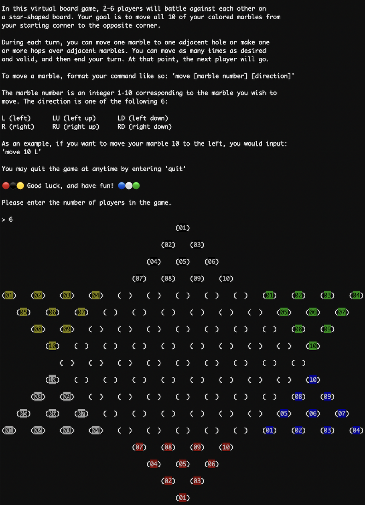

# Chinese (Caml) 🐫 Checkers  
Interactive multiplayer version of the board game 
  Chinese Checkers written in OCaml for the CS 3110 Final Project. Supports turn-based gameplay for 2 to 6 players. 

## Team Members:   
- [Emma Ni](https://github.com/emma-ni12) (emma.ni2212@gmail.com / en257)
- [Sunny Sun](https://github.com/xiangwansun) (xiangwan.sun@gmail.com / xs275)
- [Ellyn Hu](https://github.com/EllynHu) (iriselyn@gmail.com / eyh29)

## Terminal Gameplay Visual

## Commands
#### `make`
- Rebuilds code and launches utop 
#### `make build`
- Rebuilds code
#### `make test`
- Runs code through test cases
#### `make play`
- Runs the game interface
#### `make clean`
- Runs `ocaml build -clean` to get rid of `_build` directory
#### `make doc`
- Produces HTML documentation for the project 
#### `make zip`
- Compresses project into a zip file for submission
#### `make cloc`
- Checks the number of lines of code 
